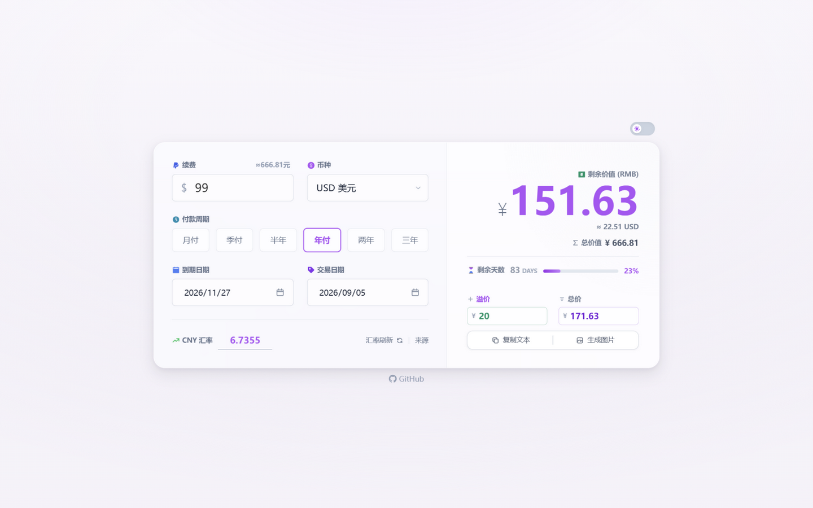
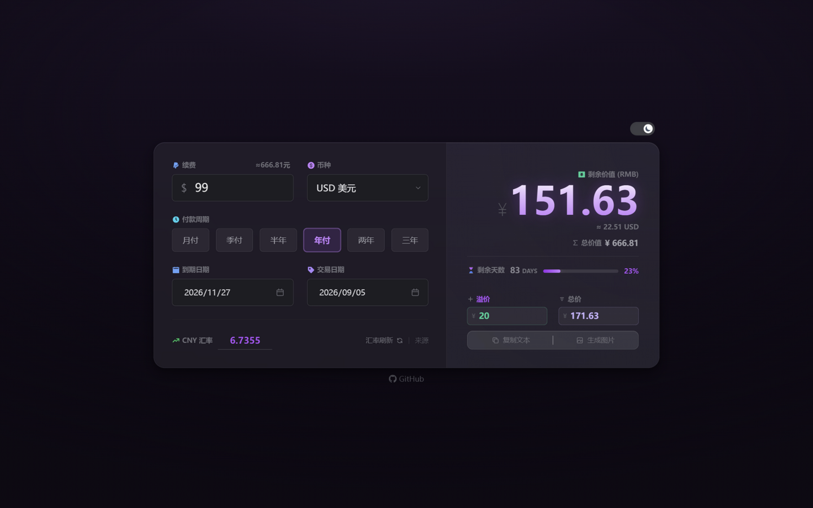

这是一个简单美观的 VPS 剩余价值计算器，支持多种货币、自定义汇率，并可以生成精美的分享图片。





✨ **特性**：
- 💰 支持多币种自动汇率转换 (USD, EUR, GBP, JPY 等)
- 📅 自动计算剩余天数和金额，展示整个付款周期的总价值
- 🧾 支持溢价 / 总价快捷换算报价
- 🎨 支持深色/浅色模式切换
- 🖼️ **一键生成交易卡片图片** (纯前端生成，无隐私泄露)
- 📱 适配移动端和 PC 端

---


## 🚀 部署

### Cloudflare Pages / Vercel / EdgeOne Pages

本项目是纯静态网站，支持直接部署到任何静态托管平台。

- **构建命令**: `npm run build`
- **输出目录**: `dist`

### Cloudflare Workers

已配置 `wrangler.toml`，支持通过 Workers 部署静态资源：

```bash
npx wrangler deploy
```
#### 一键 Cloudflare 部署：

[](https://deploy.workers.cloudflare.com/?url=https://github.com/senhao-xu/vps-jsq)

### Docker

项目提供多阶段构建的 `Dockerfile`（Node 编译 + Nginx 托管静态产物），支持 Docker / docker-compose 一键部署。

推送到 GitHub 后，Actions 会自动构建多架构镜像（`linux/amd64`、`linux/arm64`）并发布到 [GHCR](https://github.com/senhao-xu/vps-jsq/pkgs/container/vps-jsq)，可直接拉取运行：

```bash
docker run -d --name vps-jsq -p 8080:80 ghcr.io/senhao-xu/vps-jsq:latest
```

镜像以 commit sha 作为版本号（`a1aa3cb`），也可锁定特定版本：

```bash
docker pull ghcr.io/senhao-xu/vps-jsq:a1aa3cb
```

`docker-compose.yml` 已默认使用 GHCR 镜像，直接启动即可：

```bash
# 拉取 GHCR 镜像并启动（映射到宿主机 8080 端口）
docker compose up -d
```

或使用 Dockerfile 本地构建运行：

```bash
docker build -t vps-jsq .
docker run -d --name vps-jsq -p 8080:80 vps-jsq
```

启动后访问 [http://localhost:8080](http://localhost:8080) 即可使用。

- Nginx 配置（`nginx.conf`）已内置 gzip 压缩、带哈希静态资源长缓存与 SPA 兜底路由
- 可通过修改 `docker-compose.yml` 中的端口映射（默认 `8080:80`）调整访问端口

## 🛠️ 开发与构建

本项目使用 Vite + Tailwind CSS 构建。

1. 安装依赖：
   ```bash
   npm install
   ```

2. 启动本地开发服务器：
   ```bash
   npm run dev
   ```

3. 构建生产环境代码（生成 `dist/` 目录）：
   ```bash
   npm run build
   ```

---

## 📝 许可证
Apache-2.0 License
